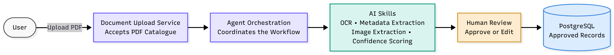
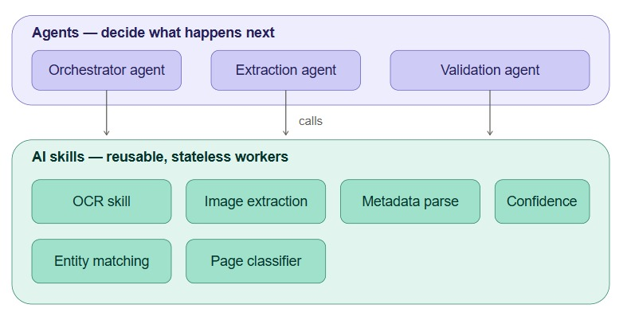
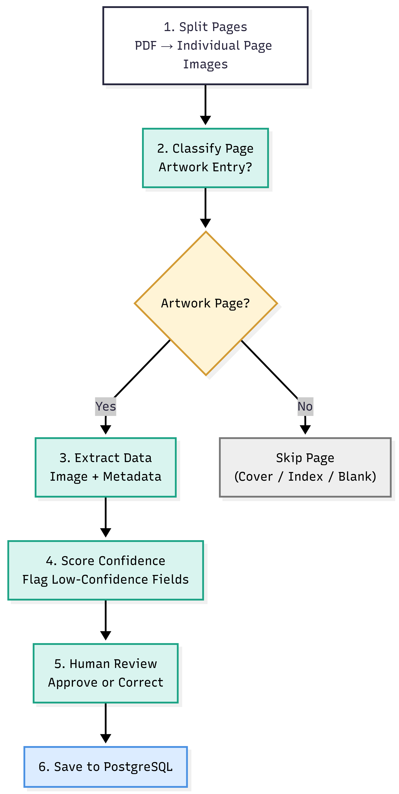
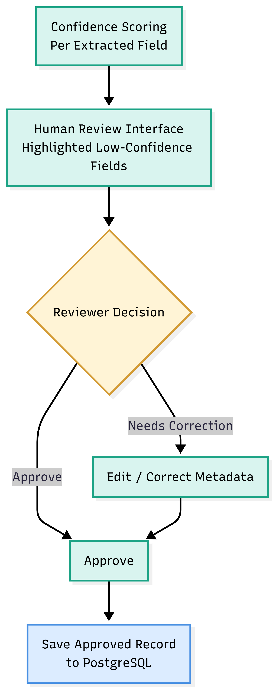
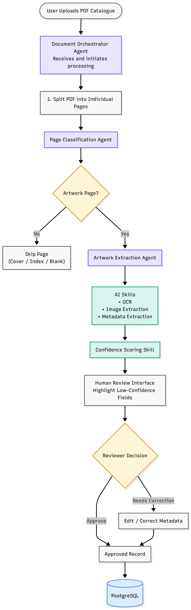
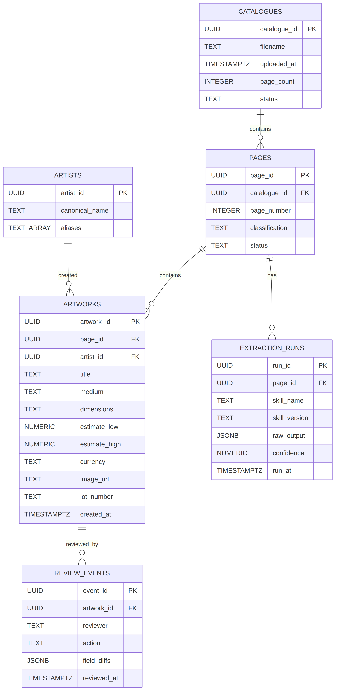

# Agentic AI Document Processing — Artwork Catalogue Extraction

System design for an Agentic AI pipeline that processes ~50-page artwork catalogue PDFs, extracts structured artwork records via AI Skills, validates them through Human-in-the-Loop review, and persists approved records to PostgreSQL.

This is a **system design exercise** — no code is included. `docs/implementation_and_deployment.md` describes concrete services, infrastructure, and technology choices to support a design walkthrough, but nothing in this repo is a running implementation.

## Contents

- [`docs/design_document.md`](docs/design_document.md) — core design document: architecture, agent responsibilities, AI skills, HITL workflow, data flow, assumptions & trade-offs
- [`docs/implementation_and_deployment.md`](docs/implementation_and_deployment.md) — addendum: microservices breakdown, technology stack, infrastructure, scaling for concurrent catalogues, testing approach, and a cost estimate
- [`diagrams/`](diagrams) — six diagrams covering system overview, agents vs. skills, workflow, HITL logic, the full detailed workflow, and the microservices architecture
- [`schema/postgres_schema.sql`](schema/postgres_schema.sql) — PostgreSQL schema for catalogues, pages, artworks, artists, and audit trails
- [`schema/postgres_er_diagram.png`](schema/postgres_er_diagram.png) — ER diagram of the schema above

## Diagrams

The pipeline is broken into six standalone diagrams — a high-level system view, the agents/skills separation, the six-step workflow, the human-review decision logic, a fully detailed end-to-end version tying agents, skills, and HITL together, and a microservices-level architecture for implementation — plus a PostgreSQL ER diagram for the data model.









## Repository Structure

```
.
├── README.md
├── docs/
│   ├── design_document.md
│   └── implementation_and_deployment.md
├── diagrams/
│   ├── 01_system_overview.png
│   ├── 02_agents_vs_skills.jpeg
│   ├── 03_workflow.png
│   ├── 04_hitl_logic.png
│   ├── 05_full_workflow_detailed.png
│   └── 06_microservices_architecture.{png,mmd}
└── schema/
    ├── postgres_schema.sql
    ├── postgres_er_diagram.png
    └── postgres_er_diagram.mmd
```
