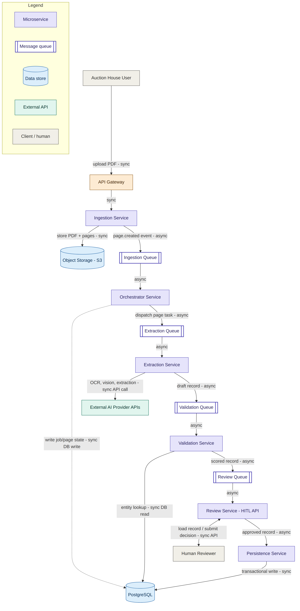

# Implementation & Deployment Addendum

**Companion to:** `docs/design_document.md`
**Scope:** Expands the original design with concrete services, technology choices, infrastructure, scaling, testing, and cost — written to support a live design walkthrough, including the reasoning behind each decision and its trade-offs.

---

## 1. High-Level System Architecture

This diagram is a different layer of abstraction than the earlier ones. The original diagrams in `diagrams/01`–`05` show **agents** — conceptual roles that decide what happens next. This diagram shows **services** — actual deployable units that would run in production, connected by real message queues instead of direct calls. Each Agent/Skill group from the base design becomes one standalone microservice: **Ingestion, Orchestrator, Extraction, Validation, Review, and Persistence.**

**Reading it top to bottom:**

- **Entry point.** The Auction House User uploads a PDF through the **API Gateway** — the only public-facing entry point into the system. No internal service is ever exposed directly to the internet.
- **Ingestion Service.** Splits the PDF into page images, writes them to **S3**, and emits a `page.created` event per page onto the **Ingestion Queue**. It doesn't decide what happens to a page next — it only produces work items. That separation keeps it simple and means splitting/storage logic never needs to know anything about extraction or review.
- **Orchestrator Service.** Reads the Ingestion Queue, owns the decision of what each page needs next, writes job/page state to **PostgreSQL**, and dispatches pages onto the **Extraction Queue**. This is the deployed form of the Orchestrator Agent from the base design.
- **Extraction Service.** Pulls from the Extraction Queue and is the *only* service that talks to **External AI Provider APIs** (OCR, vision classification, structured metadata extraction). Isolating all third-party AI dependency behind one service means swapping a provider later only touches this one place. It pushes a draft record onto the **Validation Queue**.
- **Validation Service.** Reads from the Validation Queue, does an entity-matching lookup against PostgreSQL, computes confidence scores, and pushes the scored record onto the **Review Queue**. It reads from Postgres but never writes — it isn't the source of truth.
- **Review Service (HITL API).** The one box with a different communication shape: everywhere else in the diagram, arrows are queues; between Review Service and the Human Reviewer, the arrows are a normal request/response API, because a person opening the review UI can't be made to wait on a queue round-trip.
- **Persistence Service.** The single choke point that performs the transactional write to PostgreSQL once a record is approved. Everything upstream only reads or stages data — nothing lands in the production tables without passing through this one accountable service.

**The pattern worth naming explicitly:** every service boundary in this diagram is a queue, except one — the reviewer-facing API. That asymmetry is deliberate, not an inconsistency: async is the default because it isolates failure (a slow Extraction Service doesn't block Ingestion) and lets each service scale on its own queue depth; the one synchronous exception exists specifically because a human, not a service, is waiting on the other end of it. (Section 2 below expands on this per service.)

---

## 2. Microservices and Communication

The pipeline is built as six microservices: **Ingestion, Orchestrator, Extraction, Validation, Review, and Persistence** — each detailed below, along with how they communicate.

### Why async is the default at all

Before going service by service, it's worth stating why queues are the default choice in this system, since that assumption drives everything else:

- **Failure isolation.** If the Extraction Service goes down or slows (an AI provider outage), messages simply queue up. The Ingestion Service upstream keeps accepting uploads without knowing or caring that something downstream is unhealthy. With direct synchronous calls instead, Ingestion would start failing or blocking the moment Extraction had a bad day.
- **Independent scaling.** Each service scales on its *own* queue depth, not on the load of its neighbor. If catalogues are extraction-heavy but validation-light, only Extraction workers need to scale up.
- **Built-in retry/backoff.** A failed queue message can be retried with backoff or moved to a dead-letter queue after N attempts, which comes for free with the messaging layer. A failed synchronous call just fails, and the caller has to build retry logic itself.

This isn't free — async adds latency (a message sits in a queue before pickup) and eventual-consistency complexity. So the real question per interaction isn't "sync or async by default" — it's whether *that specific handoff* needs an immediate answer or can tolerate a queue.

### Service by service

| Service | Responsibility | Communication | Why |
|---|---|---|---|
| **Ingestion Service** | Accepts upload, splits pages, stores in S3, creates catalogue/page records | Sync in (the upload response), async out (queue events) | The uploader's browser needs an immediate "received" response; everything after that is fire-and-forget |
| **Orchestrator Service** | Owns job/page state machine, dispatches tasks, handles retries | Fully async (queue in, queue out); sync writes to its own Postgres state table | Nothing outside the system needs an instant answer to "what is the Orchestrator doing right now" |
| **Extraction Service** | OCR, image extraction, metadata extraction | Async at its queue boundaries; **synchronous** to external AI provider APIs | Queues are async by design; calling a third-party AI API is inherently request/response — there's no choice there |
| **Validation Service** | Entity matching + confidence scoring | Async queues; synchronous local DB read for entity lookup | The DB read is fast and local, so the sync cost is negligible — it just needs to complete before scoring finishes |
| **Review Service (HITL API)** | Serves the reviewer UI, captures decisions | Async in (Review Queue); **synchronous** to the Human Reviewer | A person is on the other end. A reviewer clicking "load next record" can't be made to wait on an unpredictable queue delay the way a backend service can |
| **Persistence Service** | Transactional write of the approved record | **Synchronous** database transaction | A transaction has to be atomic, not eventual — you can't "eventually" commit half of `artworks` + `review_events` |

**The two exceptions to async, and why they're different reasons, not the same reason twice:**
- **Review Service is sync because of latency tolerance** — a human is waiting, and people don't tolerate queue delay the way services do.
- **Persistence Service is sync because of data integrity** — a transaction is inherently all-or-nothing; this isn't about speed at all.

That distinction — *latency-driven* sync vs. *integrity-driven* sync — is worth having ready, because "why is this one synchronous" is exactly the kind of follow-up this design invites, and having two separately justified reasons (rather than one blanket "sometimes you need sync") shows each boundary was considered individually.
---
## 3. Technology Stack per Service

| Service | Stack | Why this specifically |
|---|---|---|
| **Ingestion Service** | Python (FastAPI) + PyMuPDF/pdf2image | FastAPI gives a fast, typed API layer with minimal boilerplate; PyMuPDF reliably splits PDFs into page images and extracts the text layer when the PDF isn't scanned |
| **Orchestrator Service** | Python (FastAPI) + Temporal.io | Temporal gives durable execution, built-in retry/backoff, and visibility into long-running, multi-step workflows — replacing a lot of hand-rolled state-machine logic (full reasoning below) |
| **Extraction Service** | Python (FastAPI) + async workers (Celery or Temporal workers) | Python has the strongest ecosystem for calling AI/vision provider APIs and parsing structured LLM output; async workers let multiple pages extract concurrently without blocking |
| **Validation Service** | Python (FastAPI) + PostgreSQL `pg_trgm` | `pg_trgm` gives "good enough" fuzzy artist-name matching (e.g. "Picasso" vs. "P. Picasso") without standing up a separate search engine; swappable for Elasticsearch later if matching needs grow |
| **Review Service (HITL)** | Backend: FastAPI. Frontend: React + TypeScript | React is a practical default for an image-heavy, inline-editable review UI; FastAPI backend keeps the same language/tooling as the rest of the pipeline |
| **Persistence Service** | Python (FastAPI) + SQLAlchemy | SQLAlchemy gives transactional control (needed to write `artworks` + `review_events` atomically) and works cleanly with PostgreSQL-specific types like JSONB |

### The reasoning behind it — two decisions, explained in full

**Decision 1 — one language across all six services, not "best tool per service."**

The tempting alternative is picking the ideal language per service in isolation: Node for the Review Service's backend since it's frontend-adjacent, maybe Go for the I/O-heavy Extraction Service. For a system this size, that's usually a trap rather than rigor.

- **Operational surface is the real constraint, not per-service optimality.** Every added language means a separate dependency-management approach, a separate lint/test convention, a separate base Docker image to patch, and a team that has to debug production issues across more than one language. For a small platform team, that overhead compounds faster than the performance gains are worth.
- **None of the six services has a workload extreme enough to demand a different runtime.** Each one does roughly the same shape of work: consume a queue message, call something, produce a message or response. If one service were doing heavy numerical computation or needed extreme low-latency, that would be a real argument for a different language — nothing here rises to that bar.
- **Python fits the AI-heavy parts well**, and standardizing on it means that ecosystem investment (AI provider SDKs, structured-output parsing, PDF/image libraries like PyMuPDF) compounds across all six services instead of being siloed in one.
- **The honest cost:** a Node/React-native team might genuinely ship the Review Service faster in JavaScript to match their frontend. That's a real trade-off, accepted deliberately in exchange for a smaller, more consistent operational footprint — not an oversight.

**Decision 2 — Temporal.io, the one deliberate exception, for the Orchestrator only.**

*The problem it solves.* The Orchestrator walks a page through a long-running, multi-step sequence — classify → extract → validate → maybe wait on a human for minutes or days → persist — where any step can fail transiently and needs retry with backoff, and where a crash mid-workflow must resume exactly where it left off rather than restart or lose track of the page.

*What the hand-rolled alternative looks like, and why it tends to rot.* Without a workflow engine, this is typically built as a state column in Postgres, a poller that reads that state and decides the next action, manually written retry/backoff logic, and manual bookkeeping for stuck-record alerting. This *works* when first written, then slowly accumulates the classic distributed-systems edge cases nobody planned for: two workers picking up the same page at once, a retry succeeding but the state update after it failing, a process restarting mid-step. These aren't one big bug — they're a slow accumulation of unhandled edge cases, which is exactly where systems like this tend to degrade in production.

*What Temporal buys instead.* Durable execution as a first-class primitive (a workflow's progress is automatically checkpointed, so a crash resumes without custom recovery code), declarative retries ("retry this activity up to 3 times" rather than hand-written backoff logic), and built-in visibility into every in-flight workflow (e.g. seeing that catalogue X, page 14 has been waiting on human review for 6 hours, without a custom dashboard).

*Why the Orchestrator specifically, and not everywhere.* The other five services each do one bounded unit of work per message — consume, act, produce, done. Putting Temporal in front of, say, the Persistence Service would be paying infrastructure complexity for a problem that service doesn't have. The Orchestrator is the one place where correctness genuinely depends on durable, long-lived state.

*The honest trade-off.* Temporal is extra infrastructure to run, monitor, and — if the team hasn't used it before — learn. A smaller or less experienced team might reasonably choose the "plain SQS + Postgres state table" alternative instead, trading long-term maintenance risk for short-term simplicity.

**The pattern underneath both decisions:** consistency by default, extra complexity only where a specific, nameable problem justifies it.

### One-sentence version for the walkthrough

*"Every service runs on Python/FastAPI for a smaller, more consistent operational footprint — the one exception is Temporal.io in the Orchestrator, because that's the one service where correctness depends on durable, long-running state, and hand-rolling that kind of retry/recovery logic is exactly where systems like this tend to degrade in production."*

---

## 4. Infrastructure Overview

The point here isn't cleverness — a system this size doesn't need Kubernetes, a service mesh, or multi-region failover. It's showing the boring, correct pieces a real deployment needs, and defending the one non-obvious choice among them.

### Compute: Fargate, not Lambda

**Why Lambda looks tempting at first.** It's the default instinct for bursty, event-driven, queue-triggered work — pay per invocation, scales to zero when idle. For a short-lived task like a single Extraction Service call, Lambda would work fine on its own.

**Why it breaks down here specifically.** The blocker is the Orchestrator's Temporal workers, which are long-lived processes — they hold a persistent connection to the Temporal server and poll continuously for work. Lambda's execution model is the opposite of that: a maximum 15-minute duration, spin-up/tear-down per invocation, no support for a persistent always-listening connection. Forcing a Temporal worker into Lambda means fighting the platform instead of using it.

**Why Fargate fits, and why it's used for all six services, not just the Orchestrator.** Fargate runs containers as long-lived tasks without managing underlying instances, so Temporal workers just run continuously as designed. Rather than run two compute platforms — Lambda for five services, Fargate for one — the design uses Fargate everywhere, for the same "smaller operational surface" reasoning as the language choice: one deployment model, one scaling mechanism, one thing to reason about when something goes wrong.

**The honest cost.** Fargate tasks that are idle still cost money — there's no scale-to-zero the way Lambda has. For bursty, uneven catalogue-upload traffic, that means some amount of paid idle capacity, accepted deliberately in exchange for Temporal compatibility and one consistent deployment model.

### The rest of the stack

- **RDS for PostgreSQL (Multi-AZ)** — the schema from the base design, run managed, with Multi-AZ specifically so the one place holding the source-of-truth data isn't a single point of failure.
- **S3** — raw PDFs and page/artwork images, referenced from Postgres by URL rather than stored as blobs, keeping the database lean.
- **SQS** — the queues at every service boundary from Section 2, with dead-letter queues for tasks that exhaust retries.
- **API Gateway** — the single public entry point (upload endpoint, Review UI's API), handling auth and rate limiting at the edge so no internal service is ever directly internet-facing.
- **ECR** — where CI-built container images live before Fargate pulls and runs them.
- **Secrets Manager** — AI provider API keys and DB credentials injected into containers at runtime, never baked into images or committed to a repo.
- **CloudWatch** — logs and metrics per service, plus specifically **queue-depth and dead-letter alarms**, so a page that exhausts retries and lands in a dead-letter queue is visible immediately rather than silently sitting unprocessed.

---

## 5. Scaling for Concurrent Catalogues

### The naive answer vs. the real bottleneck

The naive answer to "how does this scale to multiple catalogues at once" is "autoscale the workers" — more catalogues, deeper queues, autoscaling adds more Fargate tasks. True, but incomplete, because it assumes compute is the constraint. It isn't.

Every page the Extraction Service processes makes outbound calls to **external AI providers**, and those providers enforce their own rate limits — some number of requests per second or tokens per minute, tied to your account. You can scale your Fargate task count from 5 to 50 in seconds; the AI provider's rate limit does not scale with you. If the provider caps you at, say, 20 requests/second, having 50 workers hammer that API simultaneously doesn't yield 50x throughput — it yields a wall of `429` errors, wasted compute retrying, and in the worst case a retry storm that makes the rate-limit problem worse. **The bottleneck under concurrent load is a resource you don't own and can't scale on demand — the AI provider — not your own infrastructure.**

### What the design does instead

A **rate limiter / request queue** sits in front of AI provider calls inside the Extraction Service — a token bucket allowing at most N requests/second to the provider, regardless of how many Fargate workers exist or how deep the Extraction Queue is. If three catalogues arrive at once needing a combined 60 requests/second but the provider allows 20, the excess work simply **waits longer in the queue** — it doesn't error, doesn't retry-storm, doesn't fail.

This reframes what "scaling" means here: scaling compute changes how many catalogues can be *in flight* at once; it does not change how fast the AI-bound part of the pipeline completes once you're past the provider's limit. A 51st Fargate task when already rate-limited just means one more worker politely waiting behind the rate limiter.

### Supporting mechanisms

- All catalogues share the same pool of queues and workers — no per-catalogue infrastructure to provision.
- Each worker service **autoscales on queue depth** (e.g. SQS's `ApproximateNumberOfMessagesVisible`), up to a configured ceiling.
- **PgBouncer** in front of RDS prevents connection exhaustion as more workers scale out concurrently.
- Every page task carries an **idempotency key** (catalogue_id + page_number), so if autoscaling or retries cause a task to be picked up twice, the second attempt is a safe no-op, not a duplicate record.

### Why this is the more mature answer

It shows the actual constraint was located rather than assuming "the cloud can always give me more compute." It also explains *how the system fails*: without the rate limiter, a burst of concurrent catalogues produces a spike of provider errors right when load is highest — the worst possible time to start failing. With it, the system gets slower under load instead of erroring, which is a far safer failure mode. And it connects to cost (Section 7): if you're rate-limited anyway, autoscaling harder during a burst is largely wasted spend on workers sitting queued behind a limit you can't scale past.

---

## 6. Testing Approach

### Why this is treated as two separate problems

The standard playbook — unit, integration, e2e — is necessary but not sufficient here, because this system's core logic isn't deterministic code, it's a model's judgment. A unit test can assert "given this input, the function returns exactly this output" for a date parser; it can't for "given this catalogue page image, extract the artist name," because the correct extraction is a judgment call, not a computation. That needs a genuinely different kind of evidence than a pass/fail assertion.

So the two categories aren't "more tests vs. fewer" — they catch two different kinds of failure. **Software correctness failures**: the code has a bug (a message parses wrong, a retry doesn't fire, a write isn't transactional). **AI quality failures**: the code runs with zero exceptions anywhere, and the system still gets the artist's name wrong — nothing in a standard test suite catches this, because nothing "broke" in the traditional sense.

### Category 1 — software correctness

- **Unit tests per skill**, with the AI provider mocked and fixed input/output fixtures — tests that the code calls the API and handles the response shape correctly, not that the AI's answer is right.
- **Contract tests between services** — since every boundary is a queue (Section 2), this validates that the message schema one service produces matches what the next expects, catching the common microservices break where a field gets renamed and a downstream consumer silently breaks.
- **Integration tests per service** against real-if-local infrastructure (LocalStack for S3/SQS, a real test Postgres) rather than only mocks, catching bugs that only appear against the actual shape of AWS's APIs.
- **End-to-end pipeline tests** — a small synthetic catalogue (3–5 pages, including a deliberate blank/cover page to exercise the classification branch) run through the full pipeline in staging, asserting the final Postgres record is correct.
- **Load testing** (k6/Locust) simulating several concurrent catalogue uploads, verifying the rate limiter and autoscaling from Section 5 behave as designed under real load, not just in theory.
- **Failure-injection testing** — deliberately killing a skill call or dropping a message to confirm the retry/dead-letter path actually engages, rather than discovering it doesn't work the first time it happens for real.

### Category 2 — AI output quality

**The mechanism: a golden dataset.** A maintained, versioned set of real catalogue pages — ideally across different auction houses and layouts — paired with hand-verified ground truth (the correct artist, title, medium, dimensions, estimate for each page), confirmed once by a person and trusted as the reference answer going forward.

**What it's used for.** Periodically, and critically **every time a prompt changes or the extraction model is swapped or upgraded**, the full pipeline runs against this dataset and its output is compared to the known-correct answers — tracking what fraction of fields extract correctly, whether the confidence score is well-calibrated (are "high confidence" extractions actually more often right?), and whether accuracy improved or regressed since the last run.

**Why this is a fundamentally different activity than a unit test.** A unit test fails once and the bug either exists or doesn't. A golden dataset score can drift over time **even when the codebase hasn't changed at all** — if the AI provider silently updates their model, or a prompt tweak fixes one edge case while degrading another, every unit test still passes, but real-world accuracy could have quietly gotten worse. Without this dataset, that regression stays invisible until reviewers start noticing more corrections are needed — a much slower and more expensive way to find out.

**Why it matters for the HITL design specifically, not just accuracy in the abstract.** The entire confidence-gated review design (base design doc, Section 6) depends on trusting that a high confidence score really does mean "more likely correct." If the score is poorly calibrated — the model is just as "confident" about wrong answers as right ones — the whole cost/safety argument for auto-approving high-confidence records collapses. The golden dataset is what lets you actually verify that calibration holds, rather than assuming it.

### Why naming Category 2 unprompted matters

Most answers to "how would you test this" stop at Category 1 — which is a complete and correct answer to "how do you test a system," just incomplete for *this* system. Naming Category 2 explicitly signals the AI extraction step isn't being treated as a function call that either works or throws — its correctness is probabilistic and can silently drift, which needs an ongoing measurement process, not a one-time pass/fail suite.

---

## 7. Cost Estimate for Processing One Catalogue

This is a rough, order-of-magnitude estimate, not a quote — the value is in showing the system decomposed into its cost-driving components and reasoning about which one dominates, not the exact dollar figure.

**Assumptions**
- 50-page catalogue; ~35 pages classified as containing an artwork lot (covers/index/blank pages filtered out cheaply before anything expensive runs)
- OCR via a managed service, roughly $1.50 per 1,000 pages
- Metadata extraction: one LLM call per artwork page (~1,500 input / ~300 output tokens), at roughly $3 / $15 per million input/output tokens
- Page classification: a cheap vision call, ~$0.001–0.005 per page
- ~30% of extracted records fall below the confidence threshold and need human review, at ~1–2 minutes per record, at an assumed $20/hour reviewer rate

| Cost component | Estimate | Why it's this size |
|---|---|---|
| OCR (50 pages) | ~$0.08 | Cheap, mature, high-volume commodity service |
| Page classification (50 pages) | ~$0.15–0.25 | Small model, small task, runs on every page even the filtered-out ones |
| Metadata extraction (35 pages) | ~$0.35–0.70 | The most expensive AI step — a full LLM call per artwork page |
| Entity matching | <$0.01 | A database lookup, not an AI call |
| Compute (Fargate task time) | ~$0.05–0.15 | Short-lived container work per catalogue |
| Storage (S3 + RDS rows) | <$0.01 | Negligible at this volume |
| **AI + infra subtotal** | **~$0.65–1.20** | |
| Human review labor | **~$3.50–7.00** | ~10–11 flagged records × 1–2 min × $20/hr |
| **Total per catalogue** | **~$4–8** | |

### Why AI comes out cheap

Two structural reasons, not luck: **volume is small per catalogue** — ~35 LLM calls at roughly 1,800 total tokens each costs fractions of a cent per call, and the economics of LLM pricing only get concerning at much higher volume than a single catalogue generates. And **classification filters expensive work down early** — only pages that actually contain artwork reach the expensive metadata-extraction call; if every page went straight to metadata extraction without that filter, the expensive LLM rate would apply to pages with nothing to extract.

### Why human review dominates instead

A person's time, priced hourly, is expensive per unit next to a fraction-of-a-cent API call. Even a short 1–2 minute review costs more than the entire AI pipeline for that catalogue combined, because it's priced in human-labor rates against AI rates priced in fractions of a cent. Concretely: ~10–11 records reviewed at $20/hour already comes to 3–5x the entire AI + infrastructure cost for the whole catalogue — the AI did 35 extractions, the human touched ~10 of them, and still costs more in total.

### The design implication this produces

Once labor is known to dominate, the confidence threshold in the HITL design isn't just an accuracy dial — it's **a cost dial**. Loosening the threshold (auto-approving more) lowers labor cost but raises the risk of a wrong field slipping through unreviewed. Tightening it raises accuracy/safety but climbs labor cost — and since labor already dominates, tightening the threshold moves total cost per catalogue more than, say, switching OCR providers would. This is why *field-level* confidence gating instead of reviewing every record wholesale matters for cost, not only reviewer efficiency: if every one of the 35 records were reviewed regardless of confidence, labor cost would roughly triple while AI cost barely moves. The economic argument for confidence-gated HITL rests on AI being cheap and people not being — so the system should ask a human to do as little as the confidence data actually justifies.

### The one-sentence version

*"AI costs cents because per-catalogue volume is small and cheap classification filters out pages that don't need the expensive call; human review costs dollars because it's priced at labor rates, not API rates — and since labor is 3–5x the AI cost, the confidence threshold deciding how much gets reviewed is effectively the biggest cost lever in the system, which is exactly why field-level confidence gating, not blanket review, is the right default."*

---

## 8. Summary of Trade-offs Introduced in This Addendum

- **Temporal for orchestration** buys durability and retry visibility at the cost of an extra piece of infrastructure to run and learn — a smaller team could substitute plain SQS + a Postgres state table.
- **Fargate over Lambda** favors long-lived, stateful workers (needed for Temporal) over Lambda's simpler pay-per-invocation model, at the cost of some paid idle capacity.
- **SQS over Kafka** favors operational simplicity at this system's scale, at the cost of event replay capability if that's needed later.
- **Python across all services** trades some per-service optimality (e.g. a Node.js frontend-heavy Review Service) for a smaller, more consistent operational footprint.
- **Confidence-gated HITL over full review** is both an accuracy and a cost decision — it's the single biggest lever on total cost per catalogue, since human labor dominates the cost profile by 3–5x over AI/infra spend.

These choices reflect a reasonable default for a system at this scale — moderate catalogue volume, a small platform team — rather than a claim that they're the only correct choices.
